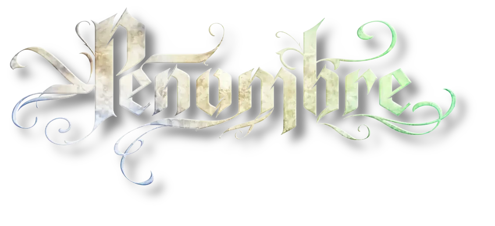

<h2>Système <em>Pénombre</em> pour Foundry Virtual TableTop</h2>

Ce système vous permet de jouer au jeu de rôle "<em>Pénombre</em>" sur la plateforme de jeu Foundry Virtual Tabletop.

    
     
    
     

<h2>Contributeurs</h2>

Ce système est développé par Kristov et Mystery Man From Outerspace, et publié avec l'accord des auteurs et ayants droits.

<h2>Mentions Légales</h2>
PÉNOMBRE est un jeu des éditions Æther Labs, sous licence Mnémos. Tous droits réservés.
Toute reproduction partielle ou totale de ce livre ainsi que son traitement informatique et sa transcription sous n’importe quelle forme et par n’importe quel moyen électronique, photocopie, enregistrement ou autre sont rigoureusement interdits sans l’autorisation préalable d’Æther Labs.

<h2>Conditions d’utilisation Æther Labs</h2>
Ce système est publié avec l'aimable autorisation exceptionnelle des éditions Æther Labs.
Ce système utilise des droits d’exploitation et/ou des droits d’auteurs qui sont la propriété des éditions Æther Labs, avec l’aimable autorisation de Mnémos.
PÉNOMBRE est un jeu des éditions Æther Labs, sous licence Mnémos. Tous droits réservés.

<h2>Communauté</h2>

Rejoignez le serveur discord <a href="https://discord.gg/c9duF7TQ">Æther Labs</a> et ses nombreux canaux consacrés à Pénombre.

Rejoignez-nous sur le serveur <a href="https://discord.com/invite/pPSDNJk">Discord francophone dédié à Foundry Virtual Tabletop</a>

Nous serons ravis d'y avoir vos retours sur le système, des signalements de bug, des idées d'amélioration, ou simplement des encouragements !

<h2>Licences</h2>
<ul>
<li>Le code HTML, CSS et Javascript de ce projet est placé sous <a href="https://choosealicense.com/licenses/gpl-3.0/">licence GNU General Public License v3.0</a></li>

<li>Foundry VTT support is covered by the following license: <a href="https://foundryvtt.com/article/license/">Limited License Agreement for module development 17/02/2021</a>.</li>
</ul>